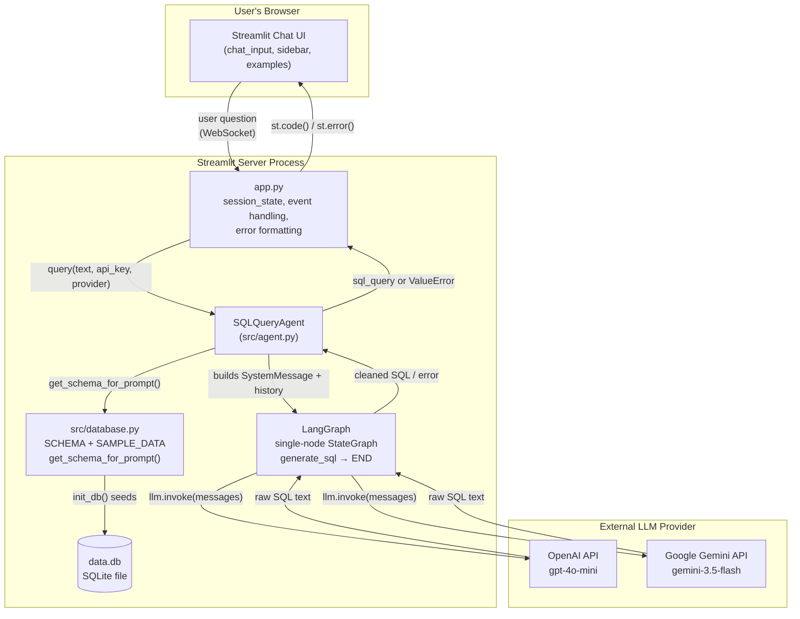
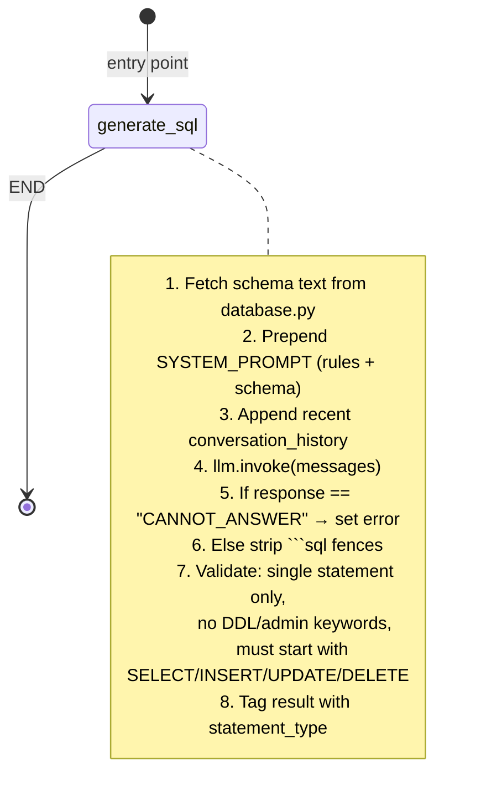

# 🔍 Natural Language to SQL Agent

A Streamlit app that lets users ask questions in plain English and get back a valid SQLite `SELECT` query, generated by an LLM (OpenAI or Gemini) orchestrated through a LangGraph agent.

---

## Table of Contents

- [Overview](#overview)
- [Project Structure](#project-structure)
- [Architecture Diagram](#architecture-diagram)
- [How the Components Are Connected](#how-the-components-are-connected)
- [The 3 Core Files](#the-3-core-files)
  - [`app.py` — UI / Streamlit layer](#apppy--ui--streamlit-layer)
  - [`src/agent.py` — Agent / LangGraph layer](#srcagentpy--agent--langgraph-layer)
  - [`src/database.py` — Data layer](#srcdatabasepy--data-layer)
- [LangGraph / LangChain Workflow Explained](#langgraph--langchain-workflow-explained)
- [Prompt(s) Used](#prompts-used)
- [Local Setup Instructions](#local-setup-instructions)
- [Known Behaviors & Limitations](#known-behaviors--limitations)

---

## Overview

This project is a **NL → SQL agent**: the user types a request like *"What are the top 3 most expensive products?"* or *"Update the stock of Wireless Mouse to 200"*, and the app returns the equivalent SQL statement — `SELECT`, `INSERT`, `UPDATE`, or `DELETE`, including joins, subqueries, and aggregations — generated against a fixed SQLite schema (customers, products, orders, etc.).

At a high level, three layers work together:

1. **UI layer** (`app.py`) — Streamlit chat interface, API key management, example questions, error display.
2. **Agent layer** (`src/agent.py`) — A LangGraph single-node graph that wraps an LLM (OpenAI `gpt-4o-mini` or Google `gemini-3.5-flash`) with a system prompt that allows full CRUD generation (`SELECT`/`INSERT`/`UPDATE`/`DELETE`, including complex joins and subqueries), plus code-level validation that blocks schema-altering statements and multi-statement payloads.
3. **Data layer** (`src/database.py`) — Defines the SQLite schema, seeds sample data, and exposes the schema as text so it can be injected into the LLM prompt.

---

## Project Structure

```
sql-agent/
├── app.py                 # Streamlit entrypoint — UI, session state, chat loop
├── requirements.txt        # Python dependencies
├── data.db                 # SQLite database file (created/reset at runtime)
└── src/
    ├── __init__.py
    ├── agent.py            # LangGraph agent: prompt, graph, SQLQueryAgent class
    └── database.py         # Schema definition, sample data, DB init helpers
```

> Note: `app.py` imports via `from src.agent import SQLQueryAgent` and `from src.database import init_db, get_schema_text, SCHEMA` — so `app.py` must sit **one level above** the `src/` package, and `src/` needs an `__init__.py` (even an empty one) to be importable as a package.

---

## Architecture Diagram



**Reading the diagram:** the LLM call is the *only* step that leaves your server — everything else (schema lookup, prompt assembly, SQL cleanup, session state) happens locally inside the Streamlit process. This matters for debugging: your browser's Network tab only shows Streamlit-server traffic, never the OpenAI/Gemini call itself.

---

## How the Components Are Connected

1. **`app.py` starts up** → calls `init_db()` (cached with `@st.cache_resource` so it only runs once per server instance) → this wipes and recreates all tables in `data.db` from `SCHEMA`/`SAMPLE_DATA` in `database.py`.
2. **User enters an API key + picks a provider** (OpenAI or Gemini) in the sidebar → stored in `st.session_state.api_key`.
3. **User submits a question** (via `st.chat_input` or an example button) → `app.py` calls `st.session_state.agent.query(user_input, api_key, provider)`.
4. **`SQLQueryAgent.query()`** (in `agent.py`):
   - Lazily builds (or rebuilds, if the provider/key changed) a LangGraph graph via `_ensure_graph()`.
   - Appends the new question to `conversation_history`.
   - Sends only the **most recent messages** (capped, not the full history) to the graph.
5. **The graph's single node, `generate_sql`**:
   - Pulls the schema text from `database.py` via `get_schema_for_prompt()`.
   - Prepends the `SYSTEM_PROMPT` (rules + schema) to the conversation.
   - Calls `llm.invoke(messages)` — this is the actual network call to OpenAI or Gemini.
   - Strips markdown code fences (```sql ... ```) from the response.
   - If the model replies `CANNOT_ANSWER`, returns a structured error instead of SQL.
6. **Result flows back up** to `app.py`, which renders it as a code block (`st.code(sql, language="sql")`) or an error banner (`st.error(...)`), and appends it to `st.session_state.chat_history` for display.

---

## The 3 Core Files

### `app.py` — UI / Streamlit layer

**What it does:**
- Sets Streamlit page config (must be the first Streamlit call).
- Initializes and caches the database (`setup_database()`).
- Manages `st.session_state` for: the `SQLQueryAgent` instance, chat history, per-provider API keys, and selected provider.
- Renders the sidebar: provider selector, API key input (session-only, never persisted to disk), a collapsible view of the DB schema, clickable example questions, and a "Clear History" button.
- Renders the chat transcript and handles new input from either `st.chat_input` or an example button click.
- Wraps the agent call in a `try/except` and translates raw provider exceptions (401, 429, 403, 404, region-lock, etc.) into human-readable messages via `describe_provider_error()` — **without ever leaking the API key** into the UI or logs.

**What it tells us:** this file is the **only** place that talks to the user directly. It owns all display logic, session state, and error translation. It has no SQL-generation logic itself — it's a thin orchestration/presentation layer over `SQLQueryAgent`.

### `src/agent.py` — Agent / LangGraph layer

**What it does:**
- Defines `AgentState`, a `TypedDict` that flows through the graph (`messages`, `user_query`, `sql_query`, `statement_type`, `response`, `context`, `error`).
- Defines `SYSTEM_PROMPT` — the instructions that allow the LLM to generate `SELECT`, `INSERT`, `UPDATE`, and `DELETE` statements, including complex joins/subqueries/aggregations, while still forbidding schema-altering DDL (full text below).
- `generate_sql()` — the one graph node: builds the message list, calls the LLM, strips code fences, then runs **defense-in-depth validation** on the output that does not rely on the model following instructions correctly:
  - Rejects multi-statement payloads (anything containing `;`).
  - Rejects DDL/admin keywords (`CREATE`, `DROP`, `ALTER`, `TRUNCATE`, `PRAGMA`, `ATTACH`, `DETACH`, `VACUUM`, `REINDEX`) even if the model produces them anyway.
  - Confirms the statement starts with an allowed keyword (`SELECT`/`INSERT`/`UPDATE`/`DELETE`) and records it as `statement_type`.
  - Detects the `CANNOT_ANSWER` sentinel for unfulfillable or ambiguous requests.
- `create_agent_graph(llm)` — builds a `StateGraph` with a single node (`generate_sql`) wired directly to `END`.
- `SQLQueryAgent` — the class `app.py` actually talks to. It:
  - Lazily creates the LangGraph graph, rebuilding it only if the API key or provider changes (`_ensure_graph`).
  - Maintains conversation history and a small `context` dict (`last_query`, `last_statement_type`).
  - Exposes `query()` (run one turn) and `reset()` (clear history for a new session).

**What it tells us:** this is the **brain** of the app — it decides how much context the LLM sees, what instructions and query types it's allowed to use, which provider/model is used, and how a raw LLM response gets turned into either validated SQL (tagged with its statement type) or a safe error. The validation step exists because an LLM's adherence to prompt instructions is a *preference*, not a *guarantee* — the code-level checks are the actual safety boundary.

### `src/database.py` — Data layer

**What it does:**
- `SCHEMA` — a dict describing every table (`customers`, `categories`, `products`, `orders`, `order_items`, `employees`), its columns (with types/constraints), and a human-readable description.
- `SAMPLE_DATA` — hardcoded rows for each table, used to seed a fresh demo database on every app start.
- `init_db()` — drops and recreates every table in `data.db`, then bulk-inserts `SAMPLE_DATA`.
- `get_schema_text()` — a friendlier, display-oriented rendering of the schema (used in the Streamlit sidebar).
- `get_schema_for_prompt()` — a compact, SQL-DDL-like rendering of the schema (used inside the LLM system prompt).

**What it tells us:** this file is the **single source of truth for the schema** — both what the user sees in the sidebar and what the LLM is told it's allowed to query come from the exact same `SCHEMA` dict, so the UI and the model can never drift out of sync with each other.

---

## LangGraph / LangChain Workflow Explained

This project uses LangGraph in its simplest possible form — a **single-node graph** — mainly for structure and future extensibility (e.g. adding a validation node, a SQL-execution node, or a retry/self-correction loop later) rather than because the current logic needs branching.



**Step by step:**

1. `AgentState` is the typed "memory" that flows through the graph — LangGraph passes this dict into each node and merges the node's return value back in.
2. `workflow = StateGraph(AgentState)` declares the graph's state shape.
3. `workflow.add_node("generate_sql", ...)` registers the (only) node, wrapped in a lambda so it has access to the already-configured `llm` instance.
4. `workflow.set_entry_point("generate_sql")` — the graph starts here.
5. `workflow.add_edge("generate_sql", END)` — after this node runs, the graph terminates (no loops, no branches).
6. `workflow.compile()` turns the declarative graph into an executable object with `.invoke(state)`.
7. At runtime, `SQLQueryAgent.query()` builds an `initial_state` and calls `self.graph.invoke(initial_state)`, which runs `generate_sql` once and returns the final state.

**LangChain's role inside the node:** `ChatOpenAI` / `ChatGoogleGenerativeAI` are LangChain's chat-model wrappers — they normalize the OpenAI and Gemini APIs behind one common interface (`.invoke(messages)`), so `agent.py` doesn't need provider-specific branching anywhere except at construction time (`_ensure_graph`).

**Why a graph at all for one node?** It future-proofs the design — e.g. adding a `validate_sql` node (checking the generated SQL against the schema before returning it), or an `execute_sql` node, or a self-correction loop (`generate_sql → validate → generate_sql` on failure) is just a matter of adding nodes/edges, without restructuring `SQLQueryAgent` or `app.py`.

---

## Prompt(s) Used

There is exactly **one** prompt in this project — the system prompt in `src/agent.py`, which is re-formatted with the live schema on every call:

```
You are a SQL expert. Convert natural language questions or instructions into valid SQLite SQL statements.

DATABASE SCHEMA:
{schema}

STRICT RULES:
1. You may generate SELECT, INSERT, UPDATE, or DELETE statements — including joins, subqueries, aggregations, CASE expressions, GROUP BY/HAVING, and multi-table conditions where the question calls for them.
2. Never generate DDL statements (CREATE, DROP, ALTER, TRUNCATE) or administrative commands (PRAGMA, ATTACH, DETACH, VACUUM, REINDEX), even if asked directly.
3. Use proper SQLite syntax.
4. Return ONLY the SQL statement, no explanations or markdown, and no trailing semicolon.
5. You may ONLY use tables and columns listed in the schema above. Do not hallucinate table or column names that do not exist in the schema.
6. Generate exactly ONE SQL statement per response — never chain multiple statements together.
7. For UPDATE and DELETE statements, include a WHERE clause that reflects the specific condition described in the request. Only write an UPDATE/DELETE with no WHERE clause if the user has explicitly and unambiguously asked to affect every row in the table.
8. If the request cannot be fulfilled with the given schema, or is ambiguous about which rows should be affected by an UPDATE/DELETE, respond with exactly: CANNOT_ANSWER
```

Where `{schema}` is filled in at request time by `get_schema_for_prompt()`, e.g.:

```
customers(id INTEGER PRIMARY KEY, name TEXT NOT NULL, email TEXT UNIQUE, city TEXT, join_date TEXT)
categories(id INTEGER PRIMARY KEY, name TEXT NOT NULL, description TEXT)
products(id INTEGER PRIMARY KEY, name TEXT NOT NULL, price REAL NOT NULL, category_id INTEGER REFERENCES categories(id), stock INTEGER DEFAULT 0)
orders(id INTEGER PRIMARY KEY, customer_id INTEGER REFERENCES customers(id), order_date TEXT NOT NULL, status TEXT DEFAULT 'pending')
order_items(id INTEGER PRIMARY KEY, order_id INTEGER REFERENCES orders(id), product_id INTEGER REFERENCES products(id), quantity INTEGER NOT NULL, unit_price REAL NOT NULL)
employees(id INTEGER PRIMARY KEY, name TEXT NOT NULL, role TEXT NOT NULL, department TEXT, salary REAL, hire_date TEXT)
```

The **user-turn messages** are just the raw conversation — the current question plus a capped window of prior `HumanMessage`/`AIMessage` pairs from `conversation_history` (trimmed so prompt size doesn't grow unbounded as a session goes on).

**The prompt is not the only safety boundary.** Since the model can now produce data-modifying statements, `generate_sql()` also runs code-level checks on every response before it's ever shown to the user:
- Rejects anything containing `;` (blocks chained/multi-statement payloads).
- Rejects DDL/administrative keywords (`CREATE`, `DROP`, `ALTER`, `TRUNCATE`, `PRAGMA`, `ATTACH`, `DETACH`, `VACUUM`, `REINDEX`) even if the model outputs them.
- Confirms the statement actually starts with `SELECT`, `INSERT`, `UPDATE`, or `DELETE`.

These checks matter because LLM instruction-following is probabilistic, not guaranteed — the regex/keyword checks are the actual enforcement point, the prompt is just guidance.

There is no separate "response-formatting" prompt — formatting (stripping ` ```sql ` fences) is handled with plain string/regex logic in `generate_sql()`, not by asking the model.

---

## Local Setup Instructions

### 1. Prerequisites
- Python 3.11+ (avoid brand-new Python versions like 3.14 until you confirm all dependencies ship wheels for it)
- An API key for at least one provider:
  - OpenAI: https://platform.openai.com/api-keys
  - Google Gemini: https://aistudio.google.com/app/apikey (has a free tier)

### 2. Clone and set up a virtual environment
```bash
git clone <your-repo-url>
cd sql-agent
python -m venv venv
source venv/bin/activate      # Windows: venv\Scripts\activate
```

### 3. Install dependencies
Create/confirm `requirements.txt` at the project root contains at least:
```
streamlit
python-dotenv
langgraph
langchain-core
langchain-openai
langchain-google-genai
```
Then:
```bash
pip install -r requirements.txt
```

### 4. (Optional) Store an API key locally
Create a `.env` file at the project root if you want defaults pre-filled (the app also accepts keys pasted directly into the sidebar each session):
```
OPENAI_API_KEY=sk-...
GOOGLE_API_KEY=...
```
`app.py` calls `load_dotenv()` at import time, so this is picked up automatically if you wire it into the sidebar defaults.

### 5. Run the app
```bash
streamlit run app.py
```
This launches the app at `http://localhost:8501`. The SQLite database (`data.db`) is created/reset automatically on first load via `init_db()`.

### 6. Using the app
- Pick a provider (OpenAI or Gemini) in the sidebar and paste your API key.
- Either type a question in the chat box, or click one of the example questions in the sidebar.
- The generated SQL appears as a code block in the chat; error states (bad key, quota exceeded, unanswerable question) appear as red error banners instead.
- Use "🗑️ Clear History" to reset both the visible chat and the agent's internal conversation memory.

---

## Known Behaviors & Limitations

- **Demo data only, in-memory-per-deploy:** `init_db()` drops and recreates all tables from hardcoded `SAMPLE_DATA` every time the app (re)starts — nothing persists across restarts regardless of what queries are generated.
- **API keys are session-only:** kept in `st.session_state` for the life of the browser session; never written to disk or logs.
- **Generation only, no execution:** the agent generates `SELECT`/`INSERT`/`UPDATE`/`DELETE` SQL text — it does not run any of it against `data.db`. There is currently no code path that executes a data-modifying statement automatically; a human still has to take the generated SQL and run it themselves. Wiring in an execution step (with confirmation, transactions, and rollback) would be a natural next node to add to the graph, but should not be done without that safety layer given that generated statements can now delete or overwrite data.
- **Validation is keyword-based, not a full SQL parser:** the DDL/multi-statement checks in `generate_sql()` catch common cases (chained statements, `CREATE`/`DROP`/`ALTER`/etc.) but are not a substitute for a real SQL parser or a sandboxed/read-only DB connection if this is ever wired up to execute automatically.
- **UPDATE/DELETE without WHERE are possible by design:** the prompt allows this only when the user explicitly asks to affect all rows, but nothing in code enforces that a WHERE clause is present — review any generated `UPDATE`/`DELETE` (flagged with a warning badge in the UI) before running it for real.
- **Context window is capped, not summarized:** older turns are dropped outright rather than summarized, so very long conversations may lose earlier context entirely rather than degrade gracefully.
